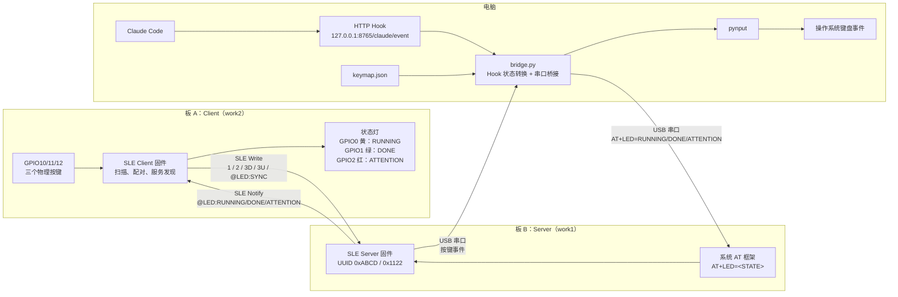

# 星闪 SLE 键盘 — 双板无线宏键盘

## 项目简介

用两块**九联星闪开发板（海思 WS63E）**，通过**星闪 SLE** 无线协议，实现三按键无线宏键盘：



系统包含两条相反方向的数据链：

- **按键上行**：Client GPIO → SLE Write → Server → USB 串口 → `bridge.py` → `keymap.json` → `pynput`。
- **状态下行**：Claude Code Hook → HTTP → `bridge.py` → `AT+LED=*` → Server → SLE Notify → Client LED。

## 硬件接线

### Server 板（work1）

| 引脚 | 连接 |
|------|------|
| USB | 电脑 USB（串口 + 供电） |
| 无需额外接线 | — |

### Client 板（work2）

| GPIO | 连接 | 按键功能 |
|------|------|---------|
| GPIO10 | → 按键 → 3.3V | 按键 A |
| GPIO11 | → 按键 → 3.3V | 按键 B |
| GPIO12 | → 按键 → 3.3V | 按键 C（支持按下/松开） |

按键按下时 GPIO 读到高电平，松开时内部下拉拉低。

### Client 板 Claude Code 状态灯

三个 LED 均按“GPIO → 限流电阻 → LED 正极，LED 负极 → GND”连接，使用高电平点亮：

| GPIO | LED 颜色 | Claude Code 状态 | 含义 |
|------|----------|------------------|------|
| GPIO0 | 黄色 | `RUNNING` | Claude Code 正在处理请求或调用工具 |
| GPIO1 | 绿色 | `DONE` | 当前任务完成或处于空闲状态 |
| GPIO2 | 红色 | `ATTENTION` | 需要用户确认、等待输入或发生错误 |

任何时刻只点亮一个状态灯。Client 上电时三个灯默认熄灭；SLE 连接就绪后会向 Server 请求最新状态。

---

## 按键事件

| GPIO | 按下发送 | 松开发送 |
|------|---------|---------|
| 10 | `1` | — |
| 11 | `2` | — |
| 12 | `3D` | `3U` |

Server 收到 SLE 数据后**原样透传**到串口，不做任何翻译。

---

## keymap.json — 按键映射配置

映射由 PC 端 `keymap.json` 文件定义，修改后无需重启 `bridge.py`，自动热重载。

### Web 可视化编辑器（推荐）

`bridge.py` 运行后，浏览器打开 `http://127.0.0.1:8765/` 即可可视化编辑映射：

- 每个按键码一张卡片，动作类型用下拉框选择，键名支持下拉补全或直接输入单个字符。
- 点击「保存到 keymap.json」写回文件，bridge 自动热重载，无需重启。
- 保存前自动校验键名与动作类型，非法配置会逐条报错而不会写入。

相关接口：`GET /api/keys`（合法键名与动作类型）、`GET /api/keymap`（当前配置）、`POST /api/keymap`（校验并保存）。

### 默认配置

```json
{
  "1":  { "type": "PRESS",     "keys": ["enter"] },
  "2":  { "type": "PRESS",     "keys": ["backspace"] },
  "3D": { "type": "HOLD_DOWN", "keys": ["ctrlleft", "winleft"] },
  "3U": { "type": "HOLD_UP",   "keys": ["ctrlleft", "winleft"] }
}
```

### 动作类型

| type | 说明 | 示例 |
|------|------|------|
| `PRESS` | 单击一个键 | `"keys": ["enter"]` |
| `HOTKEY` | 组合键（按下再松开） | `"keys": ["ctrlleft", "c"]` |
| `HOLD_DOWN` | 按住组合键（保持） | `"keys": ["ctrlleft", "winleft"]` |
| `HOLD_UP` | 松开组合键 | `"keys": ["ctrlleft", "winleft"]` |

### 支持的键名

`enter`, `backspace`, `esc`, `space`, `tab`, `delete`,
`ctrlleft`, `ctrlright`, `altleft`, `altright`, `shiftleft`, `shiftright`, `winleft`, `winright`,
`f1`~`f12`, `up`, `down`, `left`, `right`, `home`, `end`, `pageup`, `pagedown`, `insert`,
单个字符直接使用（如 `a`, `c`, `1`）。

---

## 构建与烧录

```bash
cd /root/ws63_ohos

# 编译 Server
python build.py -p nearlink_dk_3863@hihope -T "applications/sample/wifi-iot/app/work1:work1_demo"

# 编译 Client
python build.py -p nearlink_dk_3863@hihope -T "applications/sample/wifi-iot/app/work2:work2_demo"
```

两块板分别烧录对应固件。Server 上电后等待约 1 秒，再启动 SLE 服务和 AT 命令注册。

---

## bridge.py — PC 端统一桥接

### 安装依赖

```bash
pip install pynput pyserial
```

### 运行

```bash
python bridge.py
```

脚本同时承担两项工作：

1. 读取串口原始事件（`1`/`2`/`3D`/`3U`），根据 `keymap.json` 执行对应键盘动作；运行中修改配置会自动重新加载。
2. 在 `http://127.0.0.1:8765/claude/event` 接收 Claude Code Hook，通过系统 AT 串口向 Server 发送 `AT+LED=RUNNING`、`AT+LED=DONE` 或 `AT+LED=ATTENTION`；Server 再通过 SLE 将对应的 `@LED:*` 状态通知给 Client。

状态查询地址为 `http://127.0.0.1:8765/status`。Server 启动日志中的 `AT+LED register ret:0` 表示命令注册成功。按 `Ctrl+C` 退出时，脚本会释放所有按键并关闭串口。

### Claude Code Hook 配置

编辑用户级配置文件：

- Windows：`C:\Users\<用户名>\.claude\settings.json`
- 配置修改后需要完全退出并重新启动 Claude Code。
- 如果文件中已有 `env` 或其他配置，只合并下面的 `hooks` 内容，不要覆盖原有字段。

下面是可直接复制的完整 Hook 配置。若 `settings.json` 已有其他字段，请只合并其中的 `hooks` 对象：

```json
{
  "hooks": {
    "UserPromptSubmit": [
      {
        "matcher": "",
        "hooks": [
          {
            "type": "http",
            "url": "http://127.0.0.1:8765/claude/event",
            "timeout": 5
          }
        ]
      }
    ],
    "PreToolUse": [
      {
        "matcher": "",
        "hooks": [
          {
            "type": "http",
            "url": "http://127.0.0.1:8765/claude/event",
            "timeout": 5
          }
        ]
      }
    ],
    "PostToolUse": [
      {
        "matcher": "",
        "hooks": [
          {
            "type": "http",
            "url": "http://127.0.0.1:8765/claude/event",
            "timeout": 5
          }
        ]
      }
    ],
    "PermissionRequest": [
      {
        "matcher": "",
        "hooks": [
          {
            "type": "http",
            "url": "http://127.0.0.1:8765/claude/event",
            "timeout": 5
          }
        ]
      }
    ],
    "Notification": [
      {
        "matcher": "",
        "hooks": [
          {
            "type": "http",
            "url": "http://127.0.0.1:8765/claude/event",
            "timeout": 5
          }
        ]
      }
    ],
    "StopFailure": [
      {
        "matcher": "",
        "hooks": [
          {
            "type": "http",
            "url": "http://127.0.0.1:8765/claude/event",
            "timeout": 5
          }
        ]
      }
    ],
    "Stop": [
      {
        "matcher": "",
        "hooks": [
          {
            "type": "http",
            "url": "http://127.0.0.1:8765/claude/event",
            "timeout": 5
          }
        ]
      }
    ],
    "SessionEnd": [
      {
        "matcher": "",
        "hooks": [
          {
            "type": "http",
            "url": "http://127.0.0.1:8765/claude/event",
            "timeout": 5
          }
        ]
      }
    ]
  }
}
```

事件映射如下：

| Hook 事件 | LED 状态 | 用途 |
|-----------|----------|------|
| `UserPromptSubmit` | `RUNNING` | 用户提交新任务 |
| `PreToolUse` | `RUNNING` | Claude 准备调用工具 |
| `PostToolUse` | `RUNNING` | 工具调用完成，任务仍在继续 |
| `PermissionRequest` | `ATTENTION` | 立即提示用户进行权限确认 |
| `Notification` | `ATTENTION` 或 `DONE` | 权限提示、异常通知或 idle 通知 |
| `StopFailure` | `ATTENTION` | 工具或任务异常 |
| `Stop` | `DONE` | 当前任务完成 |
| `SessionEnd` | `DONE` | 会话结束 |

### 启动与验证顺序

1. 先启动并烧录 Server（work1），确认出现 `AT+LED register ret:0`。
2. 启动 Client（work2），确认完成 SLE 配对、服务发现和 `@LED:SYNC`。
3. 在项目目录运行 `python bridge.py`。
4. 重启 Claude Code，使 Hook 配置生效。
5. 提交任务并观察 bridge、Server、Client 三段日志。

正常状态链应为：

```text
[claude hook] event=PermissionRequest
[claude] LED state -> ATTENTION
AT+LED=ATTENTION
[led] AT state:@LED:ATTENTION
[ssap client] notification ... status:0
[led] state:@LED:ATTENTION
```

如果权限确认仍有延迟，先检查 bridge 是否收到 `PermissionRequest`。若只收到较晚的 `Notification(permission_prompt)`，说明 Claude Code 尚未重新加载配置，或当前版本不支持该 Hook 事件。

---

## 目录结构

```
app/
├── README.md
├── .gitignore
├── bridge.py              # PC 串口键盘 + Claude Hook 状态桥接
├── convert.py             # 旧版纯串口→键盘脚本（保留兼容）
├── keymap.json             # 按键映射配置（可编辑）
├── BUILD.gn
├── work1/                  # SLE Server（接收板，串口透传）
│   ├── BUILD.gn
│   ├── sle_uuid_server.h
│   ├── sle_uuid_server.c
│   ├── sle_server_adv.h
│   └── sle_server_adv.c
└── work2/                  # SLE Client（按键板）
    ├── BUILD.gn
    ├── sle_uuid_client.h
    └── sle_uuid_client.c
```

## 依赖

- **芯片**：海思 WS63E（九联星闪开发板）
- **系统**：OpenHarmony LiteOS-M（RISC-V 32 位）
- **编译器**：`riscv32-linux-musl-gcc`（或 `gcc-riscv64-linux-gnu` + 符号链接）
- **PC 端**：Python 3 + pynput + pyserial
